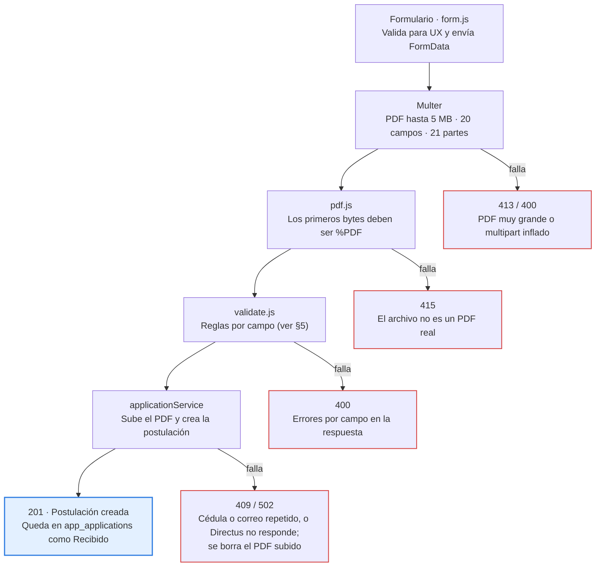

# Vacancies — Documentación Técnica

_Última actualización: 2026-10-07_

## 1. Visión general

Vacancies es el formulario público de postulación de Naranka S.A.S. (KanCan): el candidato escanea un QR, llena sus datos, adjunta su hoja de vida en PDF y la postulación queda guardada en Directus para que RR. HH. la gestione desde el módulo Vacantes de AppKancan.

Corre como servicio independiente de AppKancan (repositorio y puerto propios). No tiene base de datos local: Directus es la única fuente de persistencia.

### 1.1 Alcance

| Incluye | No incluye |
| --- | --- |
| Formulario web responsivo (celular, tablet, PC) | Gestión de postulaciones (la hace el módulo Vacantes de AppKancan) |
| Validación en cliente y servidor | Autenticación de candidatos |
| Subida del PDF a la biblioteca de archivos de Directus | Edición o retiro de una postulación por el candidato |
| Bloqueo de duplicados por cédula y por correo | Purga automática a 6 meses (pendiente, ver §12) |

### 1.2 Pila tecnológica

| Capa | Tecnología | Uso |
| --- | --- | --- |
| Runtime | Node.js 22 (mínimo 20) | Servidor; `fetch` y `process.loadEnvFile` nativos |
| Framework | Express 5 | Rutas, estáticos, manejo de errores |
| Seguridad HTTP | Helmet | Cabeceras y CSP |
| Limitación | express-rate-limit | Cupo de peticiones por IP en `/api` |
| Archivos | Multer | `multipart/form-data` y límites de tamaño |
| Backend | Directus 11 (API REST) | Postulaciones, cargos y PDFs |
| Front-end | HTML + CSS + JS sin framework | Formulario en `public/` |
| Pruebas | `node:test` + supertest | Suite con servicio Directus simulado |
| Despliegue | Docker + Coolify | Contenedor desde la rama `main` |

### 1.3 Repositorio

| Dato | Valor |
| --- | --- |
| Repositorio | `SistemasNaranka/Vacancies` (privado) |
| Ramas | `main` (producción, la despliega Coolify) · `pruebas` (desarrollo) |
| Paquete | `postulaciones-mvp` v0.1.0 |

---

## 2. Estructura del proyecto

El código se separa en capas con una responsabilidad cada una: arranque, aplicación Express, ruta, validación, servicio de negocio y cliente HTTP de Directus.

### 2.1 Árbol de directorios

```
Vacancies/
├── src/
│   ├── server.js                 # Arranque: exige variables de Directus y escucha en PORT
│   ├── app.js                    # Fábrica Express: helmet, estáticos, health, rate limit, rutas, errores
│   ├── config.js                 # Variables de entorno, CITIES y POSITIONS
│   ├── directus.js               # Cliente HTTP de Directus (fetch, token, timeout, DirectusError)
│   ├── pdf.js                    # Verificación de magic bytes %PDF
│   ├── routes/
│   │   └── applications.js       # POST /api/applications: multer, validación, mapeo de errores
│   ├── middleware/
│   │   └── validate.js           # Reglas de validación del lado servidor
│   └── services/
│       └── applicationService.js # Cargos (caché), subida de PDF, creación y rollback
├── public/
│   ├── index.html                # Formulario
│   ├── form.js                   # Validación en cliente y envío
│   ├── styles.css                # Estilos y tokens de marca
│   ├── banner.png                # Banner de campaña
│   └── favicon.svg               # Ícono
├── tests/                        # Suite node:test + supertest
├── uploads/                      # Temporal de PDFs (vacía en reposo)
├── Dockerfile
├── .env.example
├── package.json
└── README.md
```

### 2.2 Responsabilidad por archivo

| Archivo | Responsabilidad | Depende de |
| --- | --- | --- |
| `src/server.js` | Valida variables obligatorias y arranca el servidor | `app.js`, `config.js` |
| `src/app.js` | Arma la app; recibe el servicio por inyección (permite tests sin Directus real) | `routes/applications.js` |
| `src/config.js` | Carga `.env` si existe (`process.loadEnvFile` en try/catch) y expone constantes | — |
| `src/routes/applications.js` | Recibe el multipart, valida, llama al servicio, traduce errores a HTTP y borra siempre el PDF local | `validate.js`, `pdf.js`, servicio |
| `src/middleware/validate.js` | `validateApplication(body, file)` → `{ ok, errors, data }` | `config.js` |
| `src/services/applicationService.js` | Lógica de negocio: cargo nombre → id, subida del PDF, creación de la postulación, borrado del PDF si falla | `directus.js` |
| `src/directus.js` | `uploadFile`, `createItem`, `readItems`, `deleteFile`; hora de Bogotá con `enColombia()` | API de Directus |
| `src/pdf.js` | `isPdfFile(path)`: lee los primeros bytes y exige `%PDF` | — |

---

## 3. Arquitectura y flujo

Una postulación solo llega a Directus si supera, en orden, los límites de Multer, la verificación del PDF y la validación por campo; cualquier fallo corta el flujo con un código HTTP propio.



En todos los casos, el bloque `finally` borra el PDF temporal de `uploads/`. La validación del navegador es solo experiencia de usuario; la autoridad es el servidor.

### 3.1 Patrones aplicados

| Patrón | Dónde | Para qué |
| --- | --- | --- |
| Inyección de dependencias | `app.js` recibe el servicio | Los tests usan un servicio falso sin tocar el Directus real |
| Capa de servicio | `applicationService.js` | Aísla la lógica de negocio de HTTP y de Directus |
| Cliente único | `directus.js` | Un solo punto con token, timeout de 15 s y `DirectusError` |
| Compensación (rollback) | servicio | Si crear la postulación falla, se borra el PDF ya subido a Directus |
| Limpieza garantizada | `try/catch/finally` en la ruta | El PDF local nunca queda huérfano en `uploads/` |
| Caché en memoria | cargos nombre → id | Evita leer `app_positions` en cada postulación (5 min) |

### 3.2 Relación con AppKancan

Vacancies solo escribe. La lectura y gestión las hace el módulo Vacantes de AppKancan (vista de RR. HH.) contra las mismas colecciones de Directus, con otro usuario y otra política (ver §8).

---

## 4. Modelo de datos (Directus)

Las postulaciones viven en `app_applications`, enlazadas a `app_positions` por una relación M2M, y cada PDF va a la carpeta "Hojas de vida" de la biblioteca de archivos.

### 4.1 Colecciones

| Colección | Contenido | Notas |
| --- | --- | --- |
| `app_applications` | Una fila por postulación | `status` por defecto `Recibido`; `document_number` y `email` únicos |
| `app_positions` | Catálogo de cargos (campo `nombre`) | Debe coincidir con `POSITIONS` de `config.js` |
| `app_applications_app_positions` | Tabla intermedia de la M2M `positions` | Se crea junto con la postulación |
| `directus_files` (carpeta "Hojas de vida") | PDFs de hojas de vida | ID de carpeta en `DIRECTUS_CV_FOLDER` |

### 4.2 Campos de `app_applications`

| Campo | Tipo | Origen | Restricción |
| --- | --- | --- | --- |
| `document_type` | string | Formulario | `CC` o `PPT` |
| `document_number` | string | Formulario, normalizado | Único |
| `full_name` | string | Formulario | ≤ 120 caracteres |
| `email` | string | Formulario, en minúsculas | Único, ≤ 254 caracteres |
| `phone` | string | Formulario | 7–30 caracteres |
| `city` | string | Formulario | Lista `CITIES` |
| `education_level` | string | Formulario | `bachiller`, `tecnico_tecnologo`, `profesional` |
| `years_experience` | integer | Formulario | 0–99 |
| `positions` | M2M → `app_positions` | Formulario (nombre → id) | Un cargo por postulación |
| `cv` | file → `directus_files` | Subida previa del PDF | Obligatorio |
| `consent_accepted_at` | datetime | Servidor | Hora de Bogotá, sin zona (`enColombia()`) |
| `status` | string | Directus | `Recibido` al crear; RR. HH. lo actualiza |

La M2M se conserva aunque hoy se permita un solo cargo: si mañana se vuelven a admitir varios, no hay que migrar el esquema.

### 4.3 Catálogos fijos

| Catálogo | Valores | Dónde se define |
| --- | --- | --- |
| Cargos | Administrador de tienda · Cajero vendedor · Asesor comercial · Auxiliar de Bodega | `src/config.js` + `public/index.html` + `app_positions` |
| Ciudades | Armenia · Bucaramanga · Buga · Cali · Cartago · Ipiales · Jamundí · Manizales · Palmira · Pasto · Pereira · Popayán · Tuluá · Yumbo | `src/config.js` + `public/index.html` |
| Nivel educativo | Bachiller · Técnico/Tecnólogo · Profesional | `validate.js` + `public/index.html` |

Cambiar un cargo exige editar los tres lugares y redesplegar; un test de consistencia falla si `index.html` y `config.js` no coinciden.

---

## 5. Lógica de negocio y validación

El servidor rechaza cualquier postulación incompleta, con PDF falso o repetida por cédula o correo; el cliente replica las reglas solo para avisar antes de enviar.

### 5.1 Reglas por campo (`validate.js`)

| Campo | Regla | Mensaje de error |
| --- | --- | --- |
| `document_type` | Obligatorio; `CC` o `PPT` | Tipo de documento no válido. |
| `document_number` | Obligatorio; se quitan `.`, `-` y espacios; 5–20 letras o números | Usa solo letras y números (5 a 20). |
| `full_name` | Obligatorio; ≤ 120 caracteres | Máximo 120 caracteres. |
| `email` | Obligatorio; formato válido; ≤ 254; se recorta y pasa a minúsculas | Correo electrónico inválido. |
| `phone` | Obligatorio; `^\+?[0-9()\-\s]{7,30}$` | Teléfono inválido. |
| `city` | Obligatorio; dentro de `CITIES` | Ciudad no válida. |
| `education_level` | Obligatorio; valor permitido | Nivel educativo no válido. |
| `years_experience` | Obligatorio; entero `^\d{1,2}$` (0–99) | Debe ser un número entero entre 0 y 99. |
| `positions` | Obligatorio; dentro de `POSITIONS` | Selecciona un cargo. / Cargos no válidos: … |
| `cv` | Archivo obligatorio | La hoja de vida en PDF es obligatoria. |
| `data_consent` | Exactamente `'true'` | Debes aceptar el tratamiento de datos para enviar tu postulación. |

`normalizePositions()` acepta un string o un arreglo, porque un multipart con un solo valor llega como string.

### 5.2 Verificación del PDF (`pdf.js`)

`isPdfFile(filePath)` lee los primeros bytes y exige la firma `%PDF`. La extensión y el `Content-Type` no bastan: un `.exe` renombrado a `.pdf` se rechaza con 415.

### 5.3 Duplicados

La unicidad la garantiza Directus, no una lectura previa: el token del formulario no tiene permiso de leer postulaciones. Cuando Directus responde `RECORD_NOT_UNIQUE`, `duplicateMessage()` lee `extensions.field` y responde 409:

| Campo repetido | Mensaje |
| --- | --- |
| `document_number` | Ya tienes una postulación registrada con este número de documento. |
| `email` | Ya tienes una postulación registrada con este correo. |

Basta con que se repita uno de los dos para bloquear la postulación.

### 5.4 Limpieza de archivos

| Archivo | Cuándo se borra | Quién |
| --- | --- | --- |
| PDF temporal en `uploads/` | Siempre, haya éxito o error | `finally` de la ruta |
| PDF ya subido a Directus | Si la creación de la postulación falla (duplicado u otro error) | `applicationService` |

Resultado: ni `uploads/` ni la carpeta "Hojas de vida" acumulan huérfanos por reintentos.

---

## 6. API

La API expone dos endpoints: un health check exento del rate limit y el registro de postulaciones.

### 6.1 `GET /api/health`

Health check para Coolify. Se monta antes del limitador, así que nunca recibe 429.

```json
{ "ok": true }
```

### 6.2 `POST /api/applications`

Registra una postulación. Cuerpo `multipart/form-data` con los campos de §5.1 y el archivo en el campo `cv`.

```bash
curl -X POST http://localhost:3000/api/applications \
  -F document_type=CC -F document_number=1234567890 \
  -F full_name="Ana Pérez" -F email=ana@correo.com -F phone=3001234567 \
  -F city=Cali -F education_level=bachiller -F years_experience=2 \
  -F positions="Cajero vendedor" -F data_consent=true \
  -F cv=@hoja_de_vida.pdf
```

| Código | Cuerpo | Causa |
| --- | --- | --- |
| 201 | `{ "ok": true }` | Postulación creada |
| 400 | `{ "ok": false, "errors": { "<campo>": "<mensaje>" } }` | Validación fallida o multipart que excede los límites |
| 409 | `{ "ok": false, "message": "Ya tienes una postulación registrada con …" }` | Cédula o correo repetido |
| 413 | `{ "ok": false, "message": "El PDF supera el máximo de 5 MB." }` | Archivo mayor a `MAX_PDF_MB` |
| 415 | `{ "ok": false, "message": "El archivo no es un PDF válido." }` | Falla la firma `%PDF` |
| 429 | Mensaje de express-rate-limit | Más de `RATE_LIMIT_MAX` peticiones por minuto por IP |
| 502 | `{ "ok": false, "message": "No pudimos guardar tu postulación. Intenta de nuevo en unos minutos." }` | Directus caído, timeout o error no previsto |

El 502 es genérico a propósito: el detalle del error de Directus va al log del servidor, nunca al candidato.

---

## 7. Front-end

El formulario es HTML, CSS y JS sin framework, servido como estático por Express, y se usa sobre todo desde el celular del candidato tras escanear el QR.

### 7.1 Archivos

| Archivo | Contenido |
| --- | --- |
| `index.html` | Banner de campaña, campos en orden, select de cargo (uno solo), zona de arrastre del PDF, casilla de autorización y pie con política de datos |
| `form.js` | `validateClient()`, envío con `fetch` + `FormData`, manejo de 201/400/409/413/415/429/502, errores en línea, estados de la zona del PDF |
| `styles.css` | Tokens de marca, etiquetas flotantes, lista desplegable propia, estados de error/éxito/carga, responsive |

### 7.2 Orden de los campos

1. Tipo y número de documento
2. Nombre completo (un solo campo)
3. Correo electrónico
4. Teléfono / WhatsApp
5. Ciudad
6. Nivel educativo
7. Años de experiencia
8. Cargo
9. Hoja de vida en PDF (máx. 5 MB)
10. Autorización de tratamiento de datos

No hay botón "Enviar otra postulación": cada candidato usa su propio dispositivo.

### 7.3 Marca y diseño

| Token | Valor | Uso |
| --- | --- | --- |
| `--brand-600` | `#d85321` | Todo lo de marca: textos, botones, íconos, foco, hovers; también `theme-color` |
| `--brand-700` | — | Solo el hover del botón Enviar |
| `--brand-50` / `--brand-100` | — | Fondos suaves |

Un test verifica que `theme-color` de `index.html` coincida con `--brand-600`. El naranja plano da un contraste aproximado de 4.0:1 con blanco: suficiente para texto grande (WCAG AA ≥ 3:1), no para texto pequeño (≥ 4.5:1).

### 7.4 Accesibilidad

- Campos obligatorios con `required` y asterisco visible.
- Texto oculto `sr-only` para lectores de pantalla.
- `prefers-reduced-motion` desactiva animaciones.
- Tipos HTML5 (`email`, `tel`, `number`) para el teclado correcto en móvil.

### 7.5 Texto legal

La casilla dice: *Autorizo a Naranka S.A.S. (KanCan) a tratar mis datos personales y mi hoja de vida para este proceso de selección.* El pie informa el uso, la conservación por 6 meses y los derechos del titular.

---

## 8. Seguridad y permisos

El formulario opera con un token de mínimo privilegio que solo puede crear; quien lee postulaciones es RR. HH. desde AppKancan con otra política.

### 8.1 Controles en la aplicación

| Control | Implementación | Riesgo que cubre |
| --- | --- | --- |
| Cabeceras HTTP y CSP | Helmet; `upgrade-insecure-requests` solo si `ENFORCE_HTTPS=1` | XSS, clickjacking, sniffing |
| Rate limit | 60 s por ventana, `RATE_LIMIT_MAX` por IP en `/api` (salvo health) | Spam y fuerza bruta |
| Límites de Multer | `fileSize` = `MAX_PDF_MB`, 1 archivo, 20 campos, `fieldSize` 10 KB, 21 partes | Agotamiento de memoria con multipart inflado |
| Firma del PDF | `%PDF` en los primeros bytes | Ejecutables disfrazados |
| Errores opacos | 502 genérico; detalle solo en log | Filtración de la estructura interna |
| Token solo en servidor | `DIRECTUS_TOKEN` en `.env` / Coolify, nunca en `public/` | Robo del token desde el navegador |

### 8.2 `TRUST_PROXY` y rate limit

Con `TRUST_PROXY=1` y sin proxy delante, un cliente puede falsear `X-Forwarded-For` y evadir el límite. Regla:

| Topología | `TRUST_PROXY` |
| --- | --- |
| Tráfico directo al puerto publicado (situación actual) | `0` |
| Detrás del proxy HTTPS de Coolify | `1` |

Verificación: un bucle de 12 peticiones con `X-Forwarded-For` falso debe dar 429 desde la petición 11 (con `RATE_LIMIT_MAX=10`).

### 8.3 Usuarios, roles y políticas en Directus

| Usuario / rol | Política | Puede |
| --- | --- | --- |
| `formulario-vacantes` (rol `formulario_vacantes`) | `create_app_applications` | Crear postulaciones y filas de la tabla intermedia; leer cargos; subir y borrar PDFs solo en "Hojas de vida" y solo los propios (`uploaded_by = $CURRENT_USER`); leer solo el `id` de sus archivos |
| Usuarios de RR. HH. (asignación por usuario) | `rrhh_vacantes` | Leer postulaciones, cargos y tabla intermedia; actualizar solo `status`; leer archivos de "Hojas de vida" |
| Rol `pruebas` (desarrolladores) | `rrhh_vacantes` | Lo mismo que RR. HH., para soporte y monitoreo |

El token de `formulario-vacantes` vive solo en Vacancies. Nunca se usa en AppKancan.

El acceso al módulo en el menú de AppKancan se controla por usuario en `core_user_app` (Vacantes es la app 19 de `core_apps`).

### 8.4 Riesgos aceptados

| Riesgo | Decisión |
| --- | --- |
| El 409 confirma si una cédula o correo ya se postuló (enumeración) | Aceptado: bajo impacto frente a la claridad para el candidato |
| La política `crud_files` del rol Gestion Humana permite actualizar y borrar cualquier archivo | Fuera del alcance de Vacancies; escalado al jefe |

---

## 9. Configuración e instalación

Bastan tres variables de Directus para arrancar; el resto tiene valor por defecto.

### 9.1 Requisitos

- Node.js 22 (mínimo 20).
- Acceso de red al Directus de la empresa (solo LAN).
- Token del usuario `formulario-vacantes`.

### 9.2 Instalación local

```bash
git clone git@github.com:SistemasNaranka/Vacancies.git
cd Vacancies
git checkout pruebas
npm install
cp .env.example .env   # completar valores de Directus
npm run dev            # http://localhost:3000
```

### 9.3 Variables de entorno

| Variable | Obligatoria | Por defecto | Descripción |
| --- | --- | --- | --- |
| `DIRECTUS_URL` | Sí | — | URL base de Directus |
| `DIRECTUS_TOKEN` | Sí | — | Token de `formulario-vacantes` |
| `DIRECTUS_CV_FOLDER` | Sí | — | ID de la carpeta "Hojas de vida" |
| `DIRECTUS_COLLECTION` | No | `app_applications` | Colección de postulaciones |
| `PORT` | No | `3000` | Puerto del servidor |
| `UPLOAD_DIR` | No | `./uploads` | Carpeta temporal de PDFs |
| `MAX_PDF_MB` | No | `5` | Tamaño máximo del PDF |
| `RATE_LIMIT_MAX` | No | `5` | Peticiones por minuto por IP en `/api` |
| `TRUST_PROXY` | No | `1` | Saltos de proxy confiables (ver §8.2) |
| `ENFORCE_HTTPS` | No | `0` | `1` añade `upgrade-insecure-requests` a la CSP |

Si `.env` no existe, `config.js` toma las variables del entorno del contenedor; así funciona en Coolify.

### 9.4 Scripts

| Script | Comando | Uso |
| --- | --- | --- |
| `npm start` | `node src/server.js` | Producción |
| `npm run dev` | nodemon | Desarrollo con recarga |
| `npm test` | `node --test` | Suite completa |

---

## 10. Pruebas

La suite tiene 31 tests y todos pasan en `main` y `pruebas`; corren contra un servicio Directus simulado, así que no requieren red ni tocan datos reales.

### 10.1 Cobertura

| Área | Casos verificados |
| --- | --- |
| Flujo feliz | Envío válido → 201, datos entregados al servicio y PDF local borrado |
| Campos | Obligatorios faltantes → 400; correo inválido → 400; experiencia fuera de 0–99 → 400; sin autorización → 400 |
| Archivo | Sin archivo → 400; `.exe` renombrado → 415; PDF mayor al límite → 413; nombre con tildes y ñ → 201 |
| Duplicados | Cédula repetida → 409 con mensaje de documento; correo repetido → 409 con mensaje de correo |
| Abuso | Multipart inflado → 400; rate limit → 429; health nunca recibe 429 |
| Seguridad HTTP | CSP presente en las respuestas |
| Consistencia | Cargos de `index.html` = `POSITIONS`; `theme-color` = `--brand-600` |

### 10.2 Falsación antes de subir a `main`

Antes de cada push a `main` se intenta romper la app contra el Directus real con este checklist:

- [ ] Postulación nueva crea 1 fila y 1 PDF
- [ ] Cédula repetida → 409 y ningún PDF nuevo en "Hojas de vida"
- [ ] Correo repetido → 409 con mensaje de correo
- [ ] PDF de más de 5 MB rechazado
- [ ] Texto renombrado a `.pdf` rechazado
- [ ] `consent_accepted_at` coincide con la hora de Bogotá
- [ ] Multipart de 25 campos → 400
- [ ] Health 15 veces seguidas → 200
- [ ] Rate limit con `X-Forwarded-For` falso → 429 desde la petición 11
- [ ] `uploads/` vacía al terminar

Borrar en Directus los registros de prueba al terminar.

---

## 11. Despliegue y operación

Coolify construye la imagen con el `Dockerfile` del repositorio desde la rama `main`; un push a `main` más un redeploy es el único camino a producción.

### 11.1 Dockerfile

```dockerfile
FROM node:22-alpine
WORKDIR /app
COPY package*.json ./
RUN npm ci --omit=dev
COPY src/ ./src/
COPY public/ ./public/
RUN mkdir -p uploads && chown node:node uploads
USER node
EXPOSE 3000
CMD ["node", "src/server.js"]
```

La imagen copia solo `src/` y `public/`, instala sin dependencias de desarrollo y corre como usuario `node`, no como root.

### 11.2 Configuración en Coolify

| Ajuste | Valor |
| --- | --- |
| Tipo de recurso | Repositorio privado (GitHub App) |
| Rama | `main` |
| Build pack | Dockerfile |
| Puerto del contenedor | `3000` |
| Puerto publicado | `3333` |
| Health check | `GET /api/health` |
| Variables | `DIRECTUS_URL`, `DIRECTUS_TOKEN`, `DIRECTUS_CV_FOLDER`, `RATE_LIMIT_MAX=10`, `TRUST_PROXY` según §8.2 |

Coolify lo administra el jefe de área: cambios de variables y redeploys pasan por él.

### 11.3 Flujo de ramas

1. Desarrollar y probar en `pruebas` (tests en verde).
2. Falsación con el checklist de §10.2.
3. Merge de `pruebas` en `main`.
4. `git push origin main` con visto bueno del jefe.
5. Redeploy en Coolify y verificación de `/api/health`.

### 11.4 Monitoreo

| Señal | Dónde | Qué indica |
| --- | --- | --- |
| Health check | Coolify | Contenedor vivo |
| Logs del contenedor | Coolify | Errores de Directus (detrás de cada 502) |
| PDFs sin postulación en "Hojas de vida" | Directus | Falla del rollback |
| Archivos en `uploads/` | Contenedor | Falla de la limpieza local |

### 11.5 Acceso

El QR apunta al dominio DDNS en el puerto 3333. Desde la red interna el dominio público no abre; dentro de la LAN se usa la IP del servidor en el puerto 3333.

---

## 12. Pendientes y deuda técnica

Lo crítico antes de imprimir los QR es HTTPS y el valor correcto de `TRUST_PROXY` en producción; lo demás puede esperar al lanzamiento.

| Prioridad | Tarea | Dueño |
| --- | --- | --- |
| Antes del lanzamiento | `TRUST_PROXY=0` en Coolify + redeploy + verificación del 429 | Jefe de área |
| Antes del lanzamiento | HTTPS en el dominio y quitar la IPv6 falsa del DDNS; luego `ENFORCE_HTTPS=1` y `TRUST_PROXY=1` | Jefe de área |
| Antes del lanzamiento | QR definitivo con la URL final | Jefe de área |
| Después | Valor por defecto de `TRUST_PROXY` a `0` en `config.js` | Desarrollo |
| Después | No borrar el PDF subido cuando Directus solo agota el timeout de 15 s (la postulación pudo crearse) | Desarrollo |
| Después | Descripción de `package.json` aún menciona SQLite | Desarrollo |
| Antes de abril 2027 | Purga de postulaciones y PDFs con más de 6 meses, contra Directus | Desarrollo |

El antiguo `scripts/purge.sql` era para SQLite y ya no aplica: la purga debe reescribirse contra la API de Directus (o un Flow programado en Directus).

---

## 13. Glosario

| Término | Definición |
| --- | --- |
| **Postulación** | Registro en `app_applications` con los datos del candidato, su cargo y su PDF |
| **Hojas de vida** | Carpeta de la biblioteca de archivos de Directus donde se guardan los PDFs |
| **Magic bytes** | Primeros bytes de un archivo que identifican su formato real (`%PDF`) |
| **M2M** | Relación muchos a muchos de Directus, resuelta con una tabla intermedia |
| **`RECORD_NOT_UNIQUE`** | Código de error de Directus al violar un campo único |
| **Rollback de PDF** | Borrado del PDF ya subido cuando falla la creación de la postulación |
| **Rate limit** | Máximo de peticiones por IP en una ventana de tiempo |
| **`TRUST_PROXY`** | Cuántos proxies se consideran confiables para leer la IP real del cliente |
| **Coolify** | Plataforma que construye y ejecuta el contenedor de producción |
| **Falsación** | Batería de pruebas para intentar romper la app antes de subirla a `main` |
| **PPT** | Permiso por Protección Temporal, documento válido además de la CC |

---

_Documentación técnica de Vacancies — KanCan. Mantener sincronizada con el código en cada merge a `main`._
